# 📊 Задание 3: Группировка данных и оконные функции (vo_HW)

## 📝 Файлы

Все запросы доступны в файле HW3.sql

## 📂 Задачи

✅ 
**Создать таблицы со следующими структурами и загрузить данные из csv-файлов.**

  
Пруф

  
  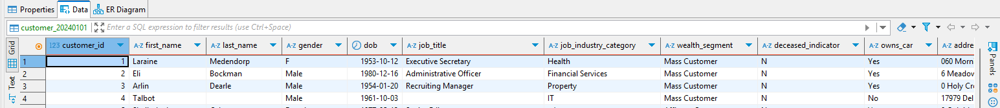

  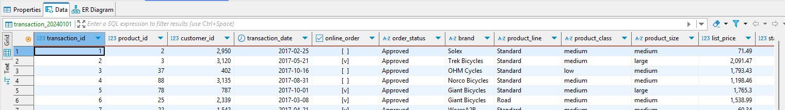
  

 

✅ 
**Вывести распределение (количество) клиентов по сферам деятельности, отсортировав результат по убыванию количества. — (1 балл)**

  
Пруф

  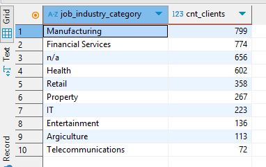

 

✅ 
**Найти сумму транзакций за каждый месяц по сферам деятельности, отсортировав по месяцам и по сфере деятельности. — (1 балл)**

  
Пруф

  
  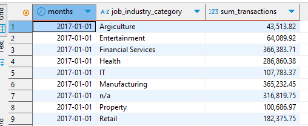

 

✅ 
**Вывести количество онлайн-заказов для всех брендов в рамках подтвержденных заказов клиентов из сферы IT. — (1 балл)**

  
Пруф

  
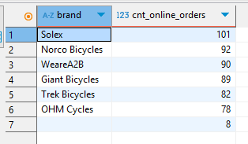

 

✅ 
**Найти по всем клиентам сумму всех транзакций (list_price), максимум, минимум и количество транзакций, отсортировав результат по убыванию суммы транзакций и количества клиентов. Выполните двумя способами: используя только group by и используя только оконные функции. Сравните результат. — (2 балла)**

  
Способ 1

  
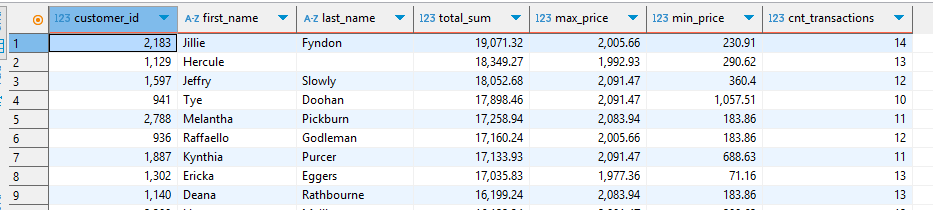

  
Способ 2

  
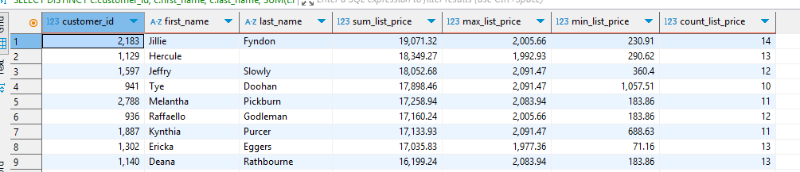

  
Сравнение через EXCEPT

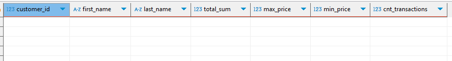

 

✅ 
**Найти имена и фамилии клиентов с минимальной/максимальной суммой транзакций за весь период (сумма транзакций не может быть null). Напишите отдельные запросы для минимальной и максимальной суммы. — (2 балла)**

  
Мин

  
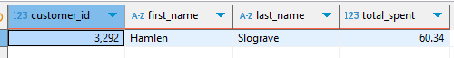

  
Макс

  
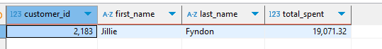

 

✅ 
**Вывести только самые первые транзакции клиентов. Решить с помощью оконных функций. — (1 балл)**

  
Пруф

  
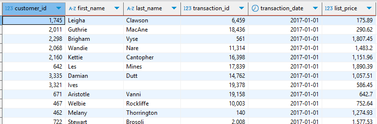

 

✅ 
**Вывести имена, фамилии и профессии клиентов, между транзакциями которых был максимальный интервал (интервал вычисляется в днях) — (2 балла).**

  
Пруф

  
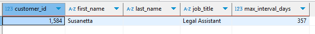

 

